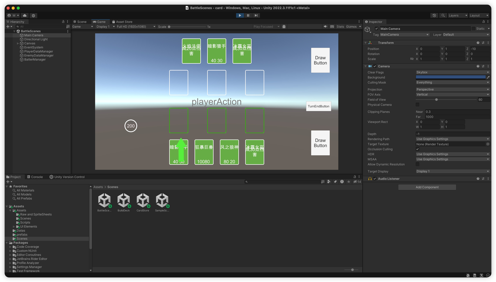
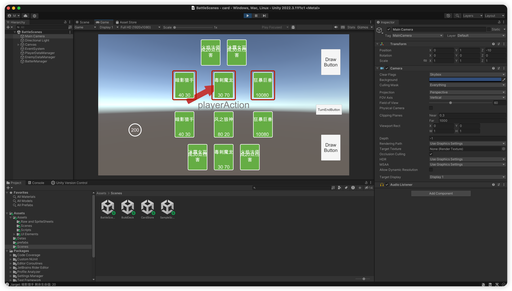

# 卡牌对战游戏

## 游戏说明

### 游戏名称：手牌风云

### 游戏类型：回合制策略游戏

### 游戏规则：

#### 一、初始积分和卡牌抽取

1. 每个玩家开始游戏时拥有一定的初始积分，每次抽卡会扣除相应积分，直到扣完为止。

2. 每次抽卡，玩家可以从卡牌市场抽取一张卡牌，卡包上限为玩家初始积分的数量。

#### 二、手牌和攻击阵营

1. 每个玩家有最多5张手牌，不够5张，可以在卡包中补充。

2. 手牌可以由玩家根据战略分配到攻击阵营，攻击阵营最多放3张卡牌。

#### 三、攻击和伤害计算

1. 当玩家被攻击时，会根据攻击阵营的卡牌的攻击值来计算伤害。

2. 伤害值等于攻击值乘以一个固定的系数，这个系数取决于攻击方的等级或者某些特殊卡牌的效果。

#### 四、回合和出牌规则

1. 游戏按照回合制进行，每个玩家每个回合只能出两次牌。

2. 在出牌前，玩家需要决定攻击的目标和攻击的阵营。

3. 每次出牌后，玩家需要展示手牌以供观察，以便其他玩家了解其战略和当前手牌情况。

#### 五、卡牌类型和效果

1. 卡牌可以分为多种类型，如攻击卡、防御卡、资源获取卡等。

2. 不同的卡牌有不同的效果，如增加攻击值、减免伤害、恢复生命等。

3. 一些特殊卡牌可能需要特定的条件才能使用，如消耗一定的积分或达到一定的等级。

#### 六、其他规则

1. 玩家需要遵守游戏规则，不得使用作弊手段或外挂软件。

2. 游戏中可能会遇到一些不可预测的情况或问题，请保持耐心和冷静，及时联系客服或寻求其他玩家的帮助。

3. 游戏结束后，可以根据积分和卡牌效果等来决定胜负。

### 卡牌游戏部分截图
**发牌**

**攻击**

## 卡牌游戏完整制作参考
- **卡牌制作教程：** https://www.bilibili.com/video/BV11o4y1D7V6/?spm_id_from=333.337.search-card.all.click&vd_source=54e20856a9f5276a04b00b90fbc51717
- **游戏脚本开发工具：**    vscode:1.84.2
- **游戏引擎：**           unity:2022.3.11f1c1
- **使用AI编程助手：**      [baidu comate](https://comate.baidu.com/)

## 代码地址
- Github：https://github.com/mcks2000/card
- Gitee：https://gitee.com/javaniuniu/card
## 公众号，微信群
欢迎关注公众号：**<PASSWORD>**，或者加入微信群：

## 声明*
非常感谢您们关注我们的游戏项目！我们正在开发一款全新且有趣的游戏，但我们的能力还处在开发游戏的初始阶段，许多内容还处在规划和开发阶段，我们会逐渐增加和改善它。我们的开发团队专注于创新、精雕细琢和完善用户体验，努力创造出一个精彩绝伦的游戏体验。

游戏功能会逐步公开并迭代优化，同时也非常欢迎大家在开发过程中提出宝贵建议。由于技术能力和经验所限，可能会有一些不确定因素，包括进度延误、错误和问题。请耐心等候并感谢您们的理解与支持。

我们会持续更新并完善游戏内容，同时也希望您能保持对开发过程的耐心和尊重。您的反馈和鼓励对我们非常重要，我们将一直努力为玩家创造更好的游戏体验。

再次感谢您们的关注和支持！